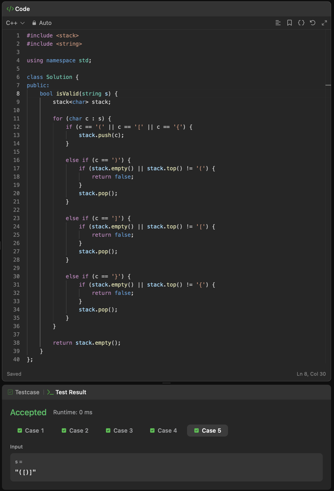

## Question 4: Reverse a Stack
To reverse a stack I would move everything from the stack into a queue, taking from the front of the queue, move everything into the original stack 

## Question 5: Valid Parenthesis

## Question 6: Copy Stack Problem
First reverse the stack using the solution from question 4. One by one, move values from the stack into the queue and into the copied stack, creating an exact copy of the original stack. 
